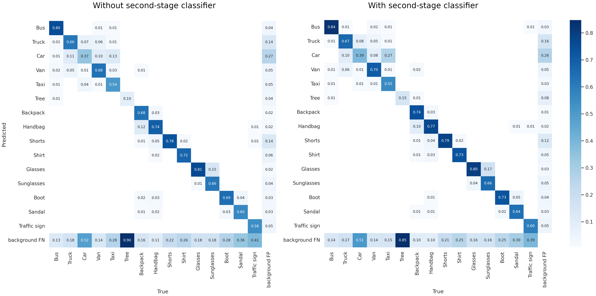

# Two-step Object Detection
## About
This project is about the *addition of a second-stage image classifier* for certain classes of objects in an *object detection pipeline*. The main idea is to merge those objects that are visually similar between each other, as a unique class, and have a pre-trained image classification model perform the required distinction.

The reasoning behind this is that *visually similar objects can pose a challenge for the object detection algorithm* (in extreme cases, causing the loss function to get stuck), especially when a large number of classes are to be detected or there is insufficient data. By relaying the task of making the correct distinction to an image classification model, which requires less training data, precision and scalability can potentially be gained at the cost of an overhead in inference time.

This concept is not new and can be found in an [article from 2017](https://www.isprs-ann-photogramm-remote-sens-spatial-inf-sci.net/IV-2-W4/67/2017/isprs-annals-IV-2-W4-67-2017.pdf), where they suggest grouping together the classes 'lamp post', 'street light', and 'traffic sign' (as separate from 'tree' and 'vehicle') in images composed of lidar point clouds. This is a translation of that same concept to modern object detection and image classification models (particularly, [YOLOv7](https://github.com/WongKinYiu/yolov7) and [EfficientNet](https://arxiv.org/abs/1905.11946)) for a more general application.

**Note:** the origin of this project does not correspond to the use case depicted here, which only serves as an example.

## Implementation


The usage of a second-stage classifier is already half-way implemented in YOLOv7's detection code by sending the predicted bounding boxes to a predefined image classification model. What is missing, mainly, is the expansion of classes to be detected and allowing for class-dependant image classifiers.

The first step is involved in merging together the visually similar classes in the dataset. In the diagram depicted above, *Car* and *Taxi*, *Backpack* and *Handbag*, *Glasses* and *Sunglasses* are grouped together in pairs (in other words, they are made to have the same class id, as done by the script ```datasets/utils/merge_classes.py```). YOLOv7-tiny is then trained on this dataset, where the total number of classes is reduced by three.

The second step concerns the training of the image classification models to discern between the aforementioned classes. This is done by cropping the bounding boxes of each of them and using these crops as datasets (```datasets/utils/crop_bboxes.py```). Offline data augmentation can be applied to this process, including shifts to make them more similar to the object detection model's predictions.

Finally, the trained models are deployed to YOLO's directory (```yolov7_twostep/models/imgclassifiers```).

### Configuration files
Two files are needed: a mapping from the merged classes to the original dataset's classes (```yolov7_twostep/cfg/second_stage/classes.yml```) and a specification of the image classification models' metadata (```yolov7_twostep/cfg/second_stage/models.yml```):
```yml
    6:
        model: backpack_handbag.tflite
        class_mapping:
            0: 6
            1: 7
        input_size: [240, 240]
        batch_size: 32
        threshold: 0.3
```

The *keys* correspond to what predicted class ID is to be sent to the specified image classification model (in this case, class six). *class_mapping* defines how to remap the model's output to the original dataset's classes. *threshold* can be used as a lower bound value, where all predictions whose score is lower than it are discarded to avoid false positives.

### Background filter
In a similar fashion, a *background filter* can be added to the pipeline, as the folks at [Tower Scout](https://github.com/TowerScout/TowerScout) have done. This consists of an image classification model trained to differentiate between the background (cropped portions of images, consisting of the same size as the objects, but with no object to be detected in them) and any object:


Such a scheme usually works in settings where there is not much variation in the background, making it easier to discern. In order to allow for *all* predictions to go through this model, the ```id``` wildcard is used, and ```-1``` stands for invalid class (i.e., it is a false positive):
```yml
    id:
        model: bckg_filter.tflite
        class_mapping:
            0: -1
            1: id
        input_size: [240, 240]
        batch_size: 32
        threshold: 0.85
```

### How to run it
The ```detect.py``` and ```test.py``` scripts can compute the full pipeline by adding the flag ```--two-step```. The weights to be used are those of YOLOv7's trained on the merged classes dataset. In the testing case, the data file has to belong to that of the original dataset.

## Example
To give a more concrete idea of how this pans out to a real case scenario, the classes mentioned in the diagram were downloaded from [Open Images V6](https://storage.googleapis.com/openimages/web/factsfigures_v6.html) and YOLOv7-tiny was trained on them as a baseline. The data distribution in the training set is as follows:


By performing the steps depicted above, we can compare the two versions of the pipeline (with and without the second-stage) in the testing set:



An overall bump in precision, alongside a reduction in background false negatives (increase in recall) can be observed, mainly due to the fact that the object detection model now has to detect fewer classes. The merged classes that benefitted the most from the addition of the second-stage were *Backpack* and *Handbag*, whereas *Glasses* and *Sunglasses* remained nearly unchanged. This supports the fact that this method is likely to be most appropiate for similar objects whose data is scarce.

## Acknowledgments
This project has received funding from the European Union's Horizon 2020 research and innovation programme under the Marie Skłodowska-Curie grant agreement No 777822.